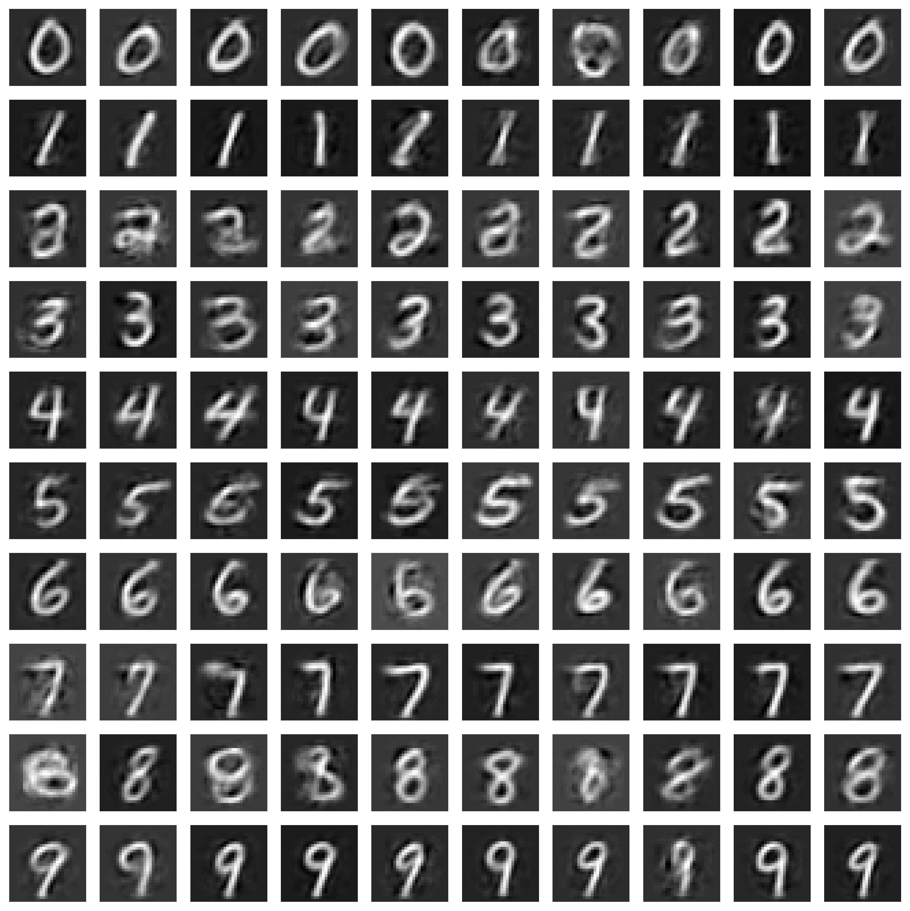
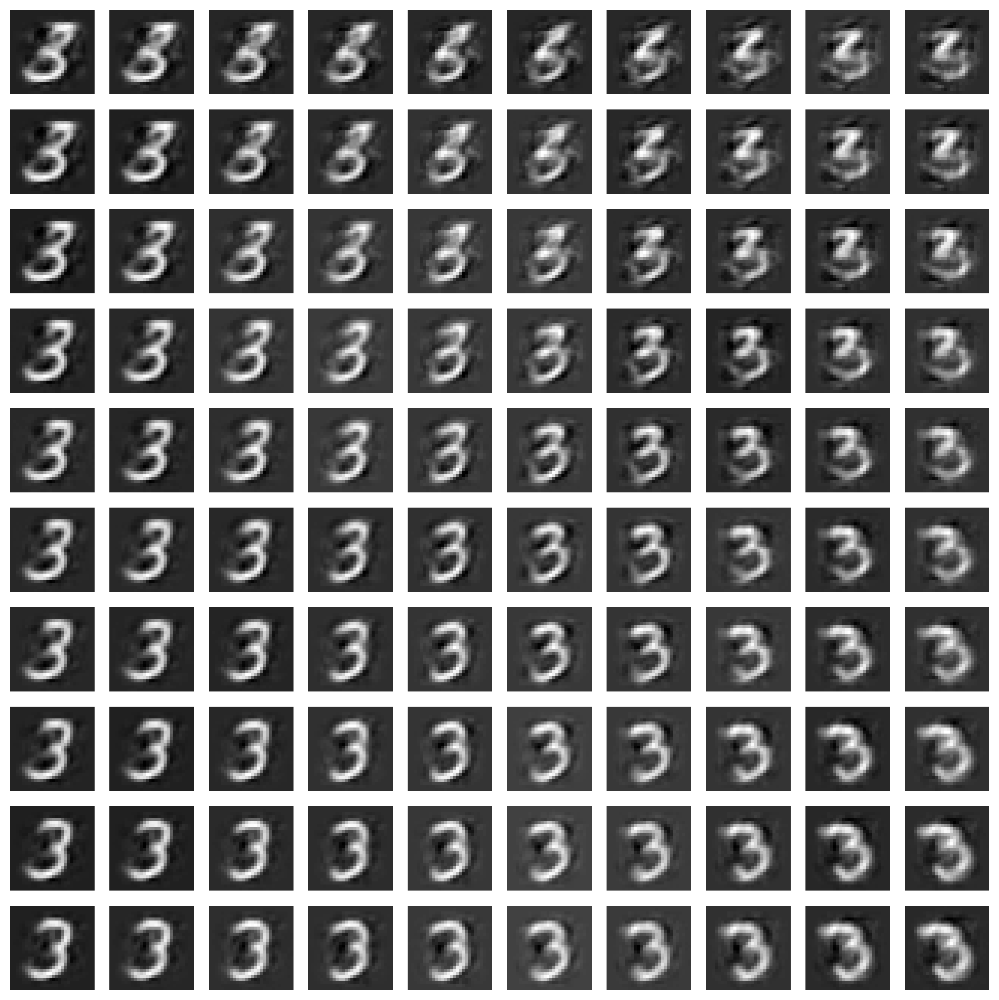
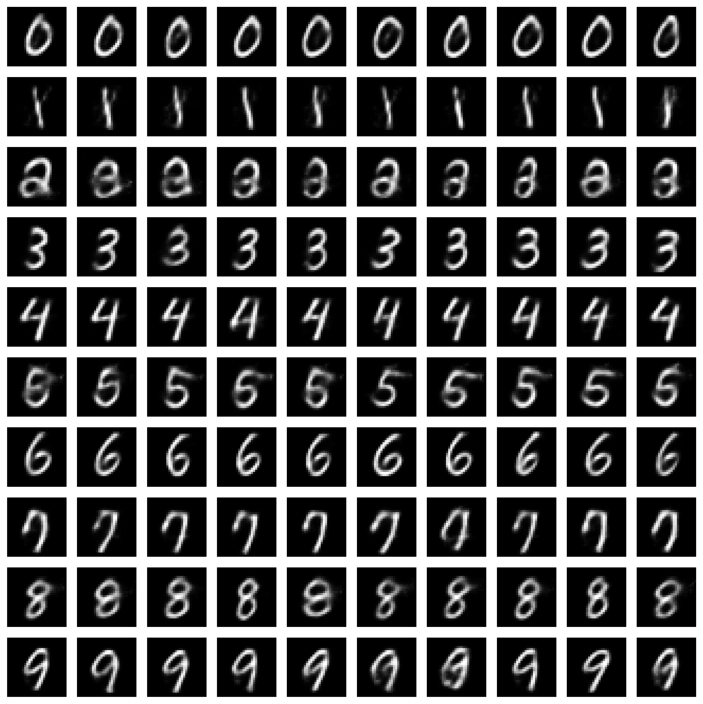
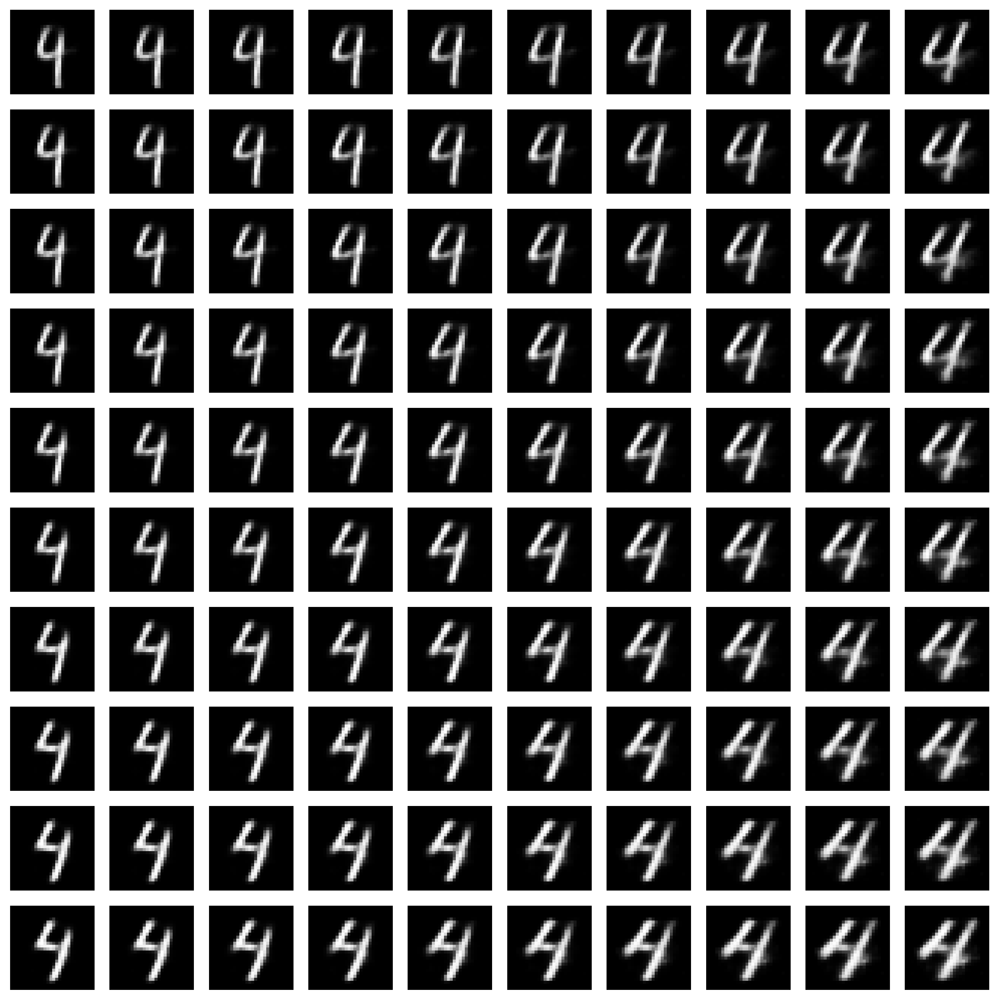

# Adverserial Autoencoders (Semi-Supervised)


*Makhzani, A., Shlens, J., Jaitly, N., Goodfellow, I., & Frey, B. (2016).** Adversarial Autoencoders. *arXiv preprint arXiv:1511.05644*. [https://arxiv.org/abs/1511.05644](https://arxiv.org/abs/1511.05644)

---
A PyTorch implementation of a **semi-supervised Adversarial Autoencoder (AAE)**, with example experiments on MNIST.  

The AAE learns a low-dimensional latent representation split into:
- a **categorical** part for class labels, and  
- a **continuous** part for “style.”
  
A report discussing the re-implementation results (including how closely it matches the original authors' results) and additional experiments can be found here:

**[AAE Semi-Supervised Report (PDF)](aae_semisupervised_report.pdf)**


## Training Results
The model was trained on the MNIST dataset of handwritten digits.

**2000 epochs, 2000 labeled samples:**

<table>
<tr>
<td></td>
<td></td>
</tr>
</table>

We can see variation in the sampled images for each digit class. The disentanglement plot shows how fixing other dimensions and sampling over two of the latent style dimensions on a grid leads to smooth variation across the styles of the digits.

**500 epochs, all labeled samples:**

<table>
<tr>
<td></td>
<td></td>
</tr>
</table>

With all labeled samples, the fidelity of generation is higher, but the style variation seems to be less relevant - the model relies more on labels and less on learning meaningful style representations. Note that with cycling of unlabeled samples for the reconstruction phase, using all labeled samples for 500 epochs means the model actually sees more data than in the 2000 epochs experiment, so it's likely somewhat overfitted.

## Installation

Clone the repo:

```bash
git clone https://github.com/flatala/adverserial-autoencoders-semi-supervised.git
cd adverserial-autoencoders-semi-supervised
```

Install requirements with:

```bash
pip install -r requirements.txt
```

Key dependencies:

- `torch >= 2.6.0`  
- `torchvision >= 0.21.0`  
- `numpy >= 2.2.5`  
- `pandas >= 2.2.3`  
- `matplotlib >= 3.10.1`  
- `tensorboard >= 2.19.0`  
- `scikit-learn == 1.6.1`  
- `notebook >= 7.4.1, < 8.0.0`  
- `jupyter >= 1.1.1, < 2.0.0`  
- `ipykernel >= 6.29.5, < 7.0.0`  
- `tqdm`


## Usage

### 1. Define model options

```python
from aae import SemiSupervisedAutoEncoderOptions, SemiSupervisedAdversarialAutoencoder

opts = SemiSupervisedAutoEncoderOptions(
    input_dim=784,
    ae_hidden_dim=1024,
    disc_hidden_dim=512,
    latent_dim_categorical=10,    # 10 classes
    latent_dim_style=16,          # style vector size
    recon_loss_fn=torch.nn.MSELoss(),
    init_recon_lr=1e-3,
    semi_supervised_loss_fn=torch.nn.CrossEntropyLoss(),
    init_semi_sup_lr=1e-3,
    init_gen_lr=1e-4,
    init_disc_categorical_lr=1e-4,
    init_disc_style_lr=1e-4,
    use_decoder_sigmoid=True
)
model = SemiSupervisedAdversarialAutoencoder(opts)
```

### 2. Prepare data loaders

Use standard PyTorch `DataLoader`s for MNIST (or your own dataset), splitting into labeled and unlabeled sets.

### 3. Train

```python
model.train_mbgd(
    train_labeled_loader,
    val_loader,
    epochs=2000,
    result_folder="results_2000_epochs_2000_samples",
    prior_std=5.0,
    add_gaussian_noise=False,
    train_unlabeled_loader=train_unlabeled_loader,
    save_interval=100
)
```

## Project Collaborators
This codebase is the part of the code that I implemended for a group project at TU Delft for the **Generative Modelling - DSAIT4030** course.
The collaborators in the project were:

- Goos, Rowdey (TU Delft)
- Łodziński, Maciej (TU Delft)
- Latała, Franciszek (Me) (TU Delft)
- Page, Henry (TU Delft)
- Savvidi, Danae (TU Delft)

